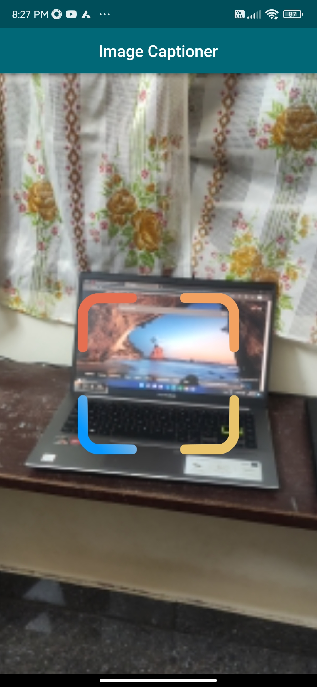
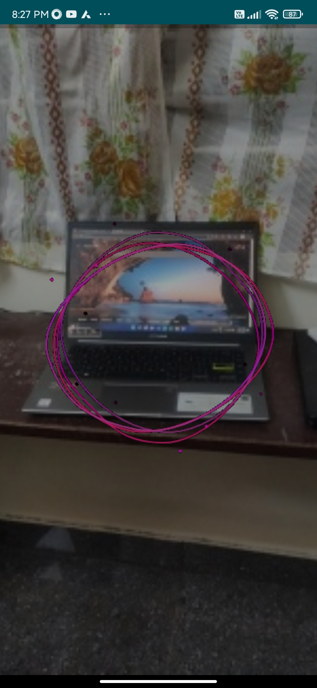
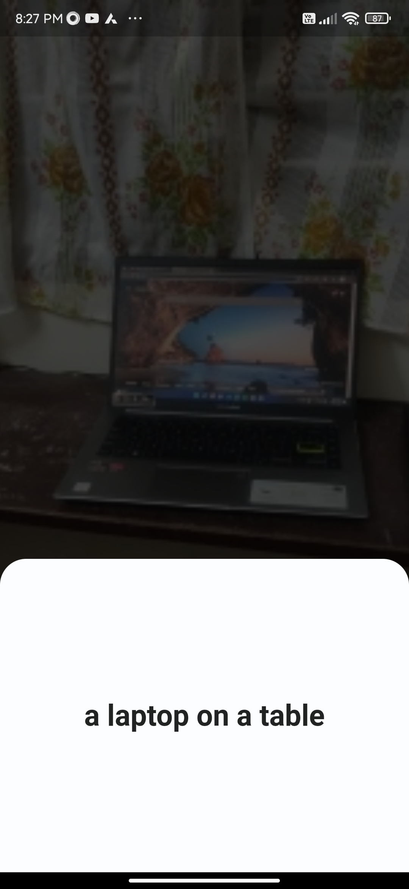
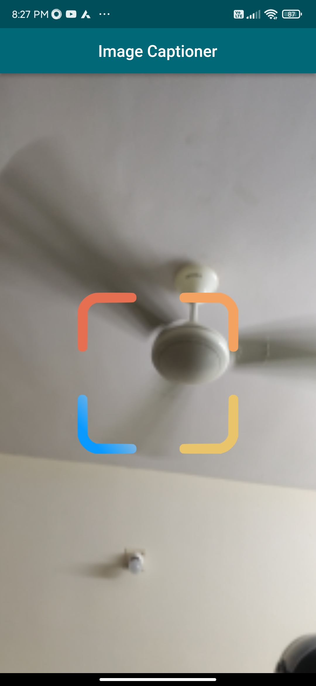
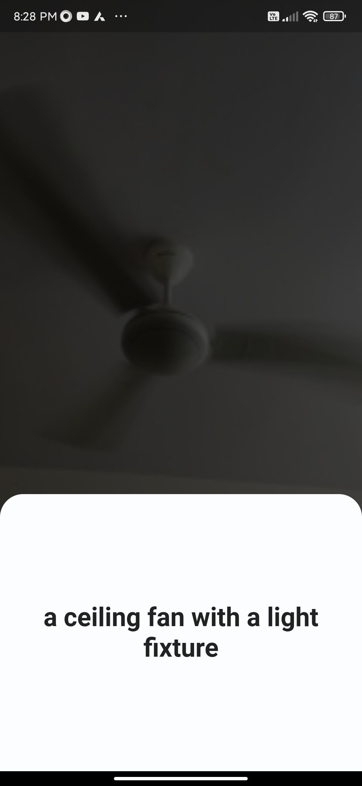

# Image Captioner App Built Using Flutter
Image captioning app is a powerful mobile application that helps users to quickly and easily create captions for their images. This app is built using Flutter and provides modern and easy to use user interface to click and generate caption for that image.

&emsp; The app allows users to take a picture with their phone camera. Once the image is picked, the app will generate a caption that accurately reflect the image’s content. 
 
&emsp; This app uses Microsoft azure cognitive service image captioning service rest API to generate captions.

## App Features

- Able to pick photos using phone's camera.
- Custom sound for camera shutter.
- Full-screen mode.
- Animations.
- Able to play captions via phone's speaker.

## Lessons Learned

- Learned how to use the Flutter Camera plugin to pick photos.-
- Learned how to use Multipart/FormData to post binary data in a REST API.
- Learned how to play audio using Flutter's JustAudio package.
- Learned how to use Flutter's Text-to-Speech package.

## Tech Stack

**Client:** Flutter

**Image captioning service:**  Microsoft Azure cognitive services 

## Demo

### Screenshots

    
    &ensp; &ensp;

    
    &ensp; &ensp;

  
     &ensp; &ensp;
 

---

  
     &ensp; &ensp;
 

  
     &ensp; &ensp;
 

### Demo Video

https://user-images.githubusercontent.com/50790161/206453580-624b0807-723f-48d4-8055-aa445a482895.mp4

